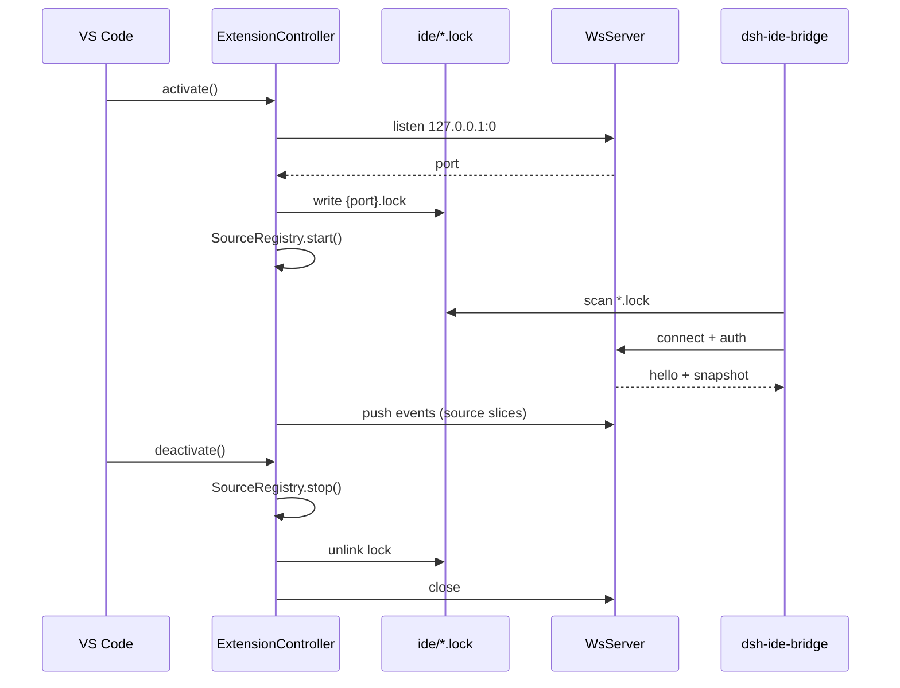

# Architecture

## Design principle: thin transport, fat sources

The extension splits into a **stable core** (discovery, WS, auth, fan-out) and pluggable **sources** (editor, breakpoints, terminal, …). Adding “git status” or “test failures” later means adding `src/sources/git/` plus `docs/sources/git.md`, not rewriting the server.

```text
extension.ts
  └─ ExtensionController
        ├─ DshHomePaths          → resolve $DSH_HOME/ide
        ├─ LockRegistry          → write/remove {port}.lock
        ├─ WsServer              → listen, auth, connections
        ├─ SnapshotStore         → merge source slices → full snapshot
        ├─ SourceRegistry        → register IdeSource instances
        └─ sources/*
              ├─ editor/
              ├─ breakpoints/
              ├─ debug-output/
              └─ terminal/
```

## Lifecycle



## Component responsibilities

### `ExtensionController`

Single entry from `activate()` / `deactivate()`. Owns startup order: paths → server → lock → sources → subscriptions. Ensures `deactivate()` always removes the lock even if a source throws.

### `LockRegistry`

- Writes `{port}.lock` atomically (write temp + rename).
- Deletes lock on shutdown.
- Optional: stale lock GC for same `workspaceFolders` + dead `pid` (best-effort; DSH client also validates `pid`).

### `WsServer`

- Binds **`127.0.0.1` only**.
- First message from client must be `auth`; otherwise close with policy violation.
- After auth: send `hello` + full `snapshot`, then stream `event` messages.
- Supports `getSnapshot` RPC-style request (optional v1).
- Connection cap (e.g. 4) to avoid accidental fan-out storms.

### `SnapshotStore`

- Holds the latest merged **`IdeSnapshot`** (see [protocol.md](protocol.md)).
- Each source writes only its **`sources[<sourceId>]`** slice.
- Increments top-level **`revision`** on any slice change (for DSH debouncing).

### `SourceRegistry`

- Registers `IdeSource` implementations in deterministic order.
- `start(ctx)` / `stop()` lifecycle.
- Forwards `onSliceChanged` to `SnapshotStore` + `WsServer.broadcast`.

## Data flow modes

| Mode | When | Use |
|------|------|-----|
| **Push** | Source data changes | Real-time web sidebar |
| **Pull** | Client sends `getSnapshot` | Reconnect sync |
| **Full snapshot on connect** | After auth | Initial UI state |

DSH model context should **not** subscribe to every push; the bridge plugin copies snapshot → session on user send.

## Multi-window / multi-root

| Case | Behavior |
|------|----------|
| One VS Code window | Lock lists that window’s `workspaceFolders`; WS pushes its snapshot |
| Several windows | Several `{port}.lock` files; DSH picks lock whose folders match session cwd (bridge responsibility) |
| No folder open | Lock still written; `workspaceFolders: []`; editor source reports empty |

This extension **does not** coordinate between windows; it only publishes facts for **this** Extension Host instance.

## Failure and degradation

| Condition | Extension behavior |
|-----------|-------------------|
| `$DSH_HOME/ide` not writable | Log error; WS may still run; lock write fails loud |
| WS port in use | Retry next port (max N attempts) |
| Source `start` throws | Disable that source; others continue; snapshot marks source `status: "error"` |
| No clients connected | Sources still update local snapshot (cheap); optional throttle when idle |

## Security

- Token: UUID v4 in lock; required on WS auth.
- No CORS concern (raw WS, not browser client from this extension).
- Do not log full `authToken` at info level.
- Lock file mode: user-only where OS supports it.

See [discovery.md](discovery.md) and [protocol.md](protocol.md) for wire formats.
