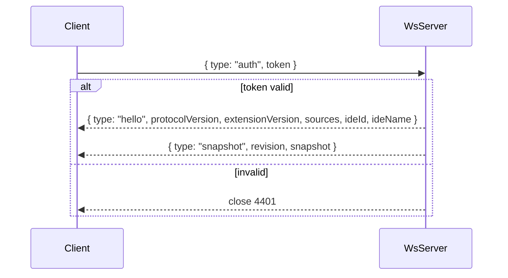

# WebSocket protocol (v1)

## Transport

- URL: `ws://127.0.0.1:{port}` (from lock file).
- Encoding: UTF-8 JSON text frames.
- One object per message; no batching in v1.

## Handshake



### Client → server: `auth`

```json
{
  "type": "auth",
  "token": "00000000-0000-4000-8000-000000000001"
}
```

Must be the **first** message. Timeout: 5s → close.

### Server → client: `hello`

```json
{
  "type": "hello",
  "protocolVersion": 1,
  "extensionVersion": "0.1.0",
  "sources": ["editor", "breakpoints", "debug-output", "terminal"],
  "ideId": "vscode",
  "ideName": "Visual Studio Code"
}
```

| Field | Notes |
|-------|-------|
| `ideId` | Stable IDE identifier (`vscode`, future: `jetbrains`, …) |
| `ideName` | Human-readable host name from the IDE |

### Server → client: `snapshot`

Full merged state after auth or on explicit pull.

```json
{
  "type": "snapshot",
  "revision": 42,
  "snapshot": { }
}
```

See [Snapshot shape](#snapshot-shape) below.

## Ongoing messages

### Server → client: `event`

Incremental update for one source slice (preferred over full snapshot for bandwidth).

```json
{
  "type": "event",
  "revision": 43,
  "sourceId": "editor",
  "sourceRevision": "7",
  "slice": { }
}
```

`slice` replaces `snapshot.sources[sourceId]` entirely (not deep merge).

### Client → server: `getSnapshot`

```json
{
  "type": "getSnapshot",
  "requestId": "req-1"
}
```

### Server → client: `snapshot` (response)

Same as push snapshot; optional `requestId` echo:

```json
{
  "type": "snapshot",
  "requestId": "req-1",
  "revision": 43,
  "snapshot": { }
}
```

### Server → client: `error`

```json
{
  "type": "error",
  "code": "UNKNOWN_MESSAGE",
  "message": "Unrecognized type: foo"
}
```

## Snapshot shape

Top-level **`IdeSnapshot`**:

```json
{
  "capturedAt": "2026-09-06T04:45:00.000Z",
  "workspaceFolders": ["C:\\Users\\alice\\my-app"],
  "sources": {
    "editor": { },
    "breakpoints": { },
    "debug-output": { },
    "terminal": { }
  }
}
```

| Field | Description |
|-------|-------------|
| `capturedAt` | ISO-8601 UTC when snapshot was assembled |
| `workspaceFolders` | Copy from lock at capture time |
| `sources` | Map of source id → slice payload |

Each slice includes common envelope fields (see [source contract](../design/source-contract.md)):

```json
{
  "status": "ok",
  "sourceRevision": "7",
  "updatedAt": "2026-09-06T04:44:58.000Z",
  "data": { }
}
```

| `status` | Meaning |
|----------|---------|
| `ok` | Source running normally |
| `degraded` | Partial data (e.g. debug console only while debugging) |
| `disabled` | User setting or capability off |
| `error` | Source failed; see `error` field |

## Source slice schemas (v1)

Detailed per-source `data` fields: [sources/](sources/).

| Source id | Summary |
|-----------|---------|
| `editor` | Active file, selection, visible editors |
| `breakpoints` | Breakpoint list + debug session summary |
| `debug-output` | Ring buffer of debug adapter output |
| `terminal` | Ring buffer of integrated terminal writes |

## Close codes

| Code | Reason |
|------|--------|
| 4401 | Auth failed or missing |
| 4403 | Too many connections |
| 1000 | Normal shutdown |

## Compatibility rules

1. **Additive fields**: clients ignore unknown JSON keys.
2. **New source ids**: appear in lock `sources` and `hello.sources`; clients ignore unknown slices.
3. **Breaking changes**: increment `protocolVersion`; old clients refuse mismatched hello.

## Example session (abbreviated)

```json
→ { "type": "auth", "token": "…" }
← { "type": "hello", "protocolVersion": 1, "extensionVersion": "0.1.0", "sources": ["editor"] }
← { "type": "snapshot", "revision": 1, "snapshot": { "sources": { "editor": { "status": "ok", "data": { "activeFile": null } } } } }
← { "type": "event", "revision": 2, "sourceId": "editor", "sourceRevision": "2", "slice": { "status": "ok", "data": { "activeFile": { "path": "…", "languageId": "typescript" } } } }
```
